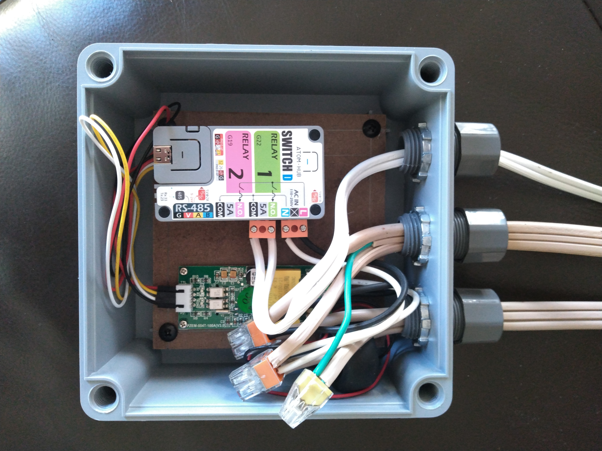
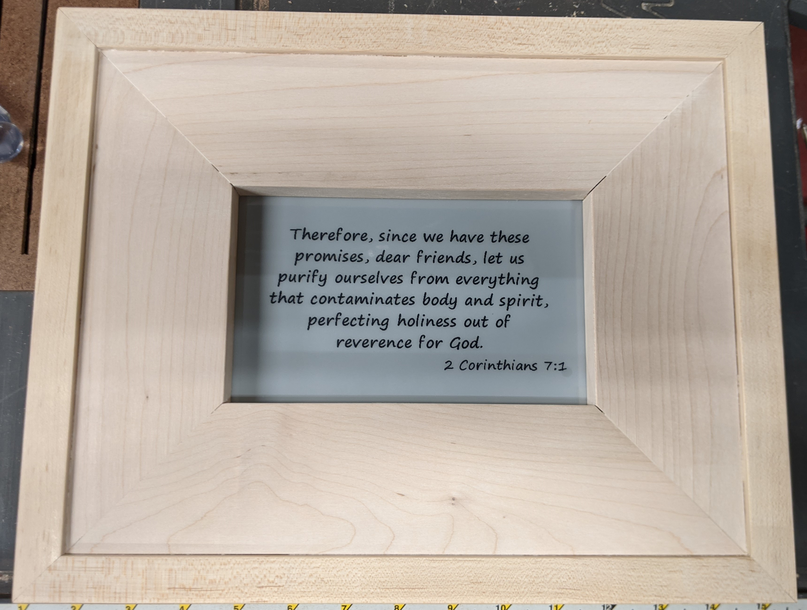
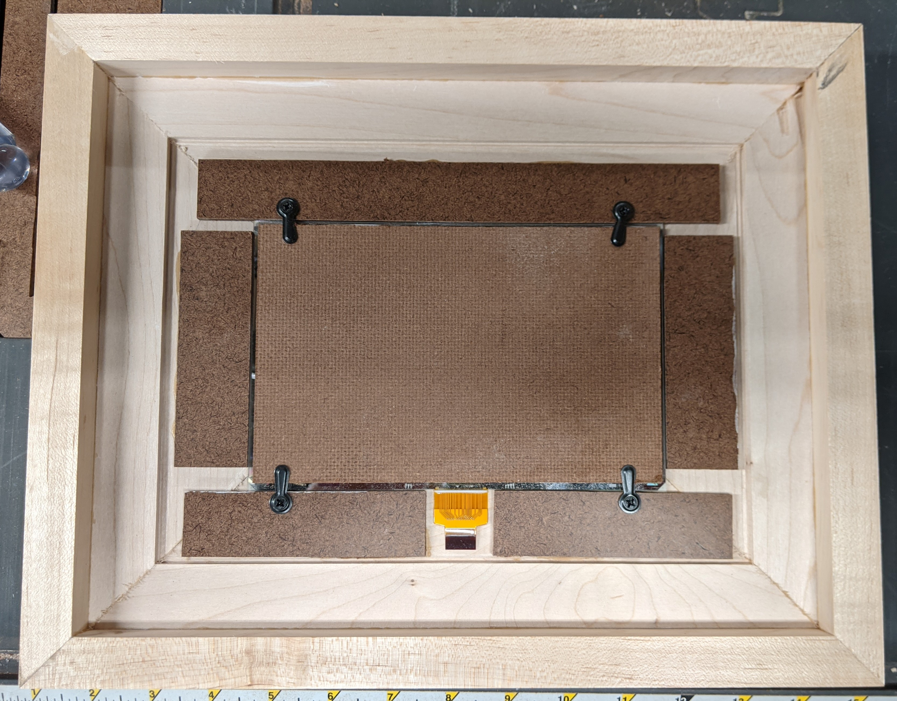

# ESPHome-Devices
## Overview
This is a collection of [ESPHome](https://ESPHome.io) custom components, configuration files, and custom code for my various ESP8266/ESP32 devices that integrate with [Home Assistant](https://www.home-assistant.io/).  I am using includes and packages pretty extensively in order to prevent duplication and allow for easy changing of common settings.

### What is ESPHome
ESPHome is a system to control your ESP8266/ESP32 by simple yet powerful configuration files and control them remotely through Home Automation systems.  For more information checkout [ESPHome.io](https://ESPHome.io).

### What is Home Assistant
Home Assistant is open source home automation that puts local control and privacy first. Powered by a worldwide community of tinkerers and DIY enthusiasts. Perfect to run on a Raspberry Pi or a local server.  For more information check out [Home-Assistant.io](https://www.home-assistant.io/).

## Folder Structure
* `/` - Yaml files for my devices and other core files
* `/components` - Custom components
* `/images` - Pictures of some of my devices
* `/packages` - Shared packages used by my devices
* `/scripts` - Couple of PowerShell scripts for managing the repo

## Secrets Management
You will notice that throughout the various folders I have secrets.yaml files. These files all do an include of the secrets.yaml file in the root folder (that for obvious reasons is not included in the repo).

## Custom Components
I have been working on updating most of my custom code into components that can easily be pulled directly from GitHub into your device configuration using the [external components](https://esphome.io/components/external_components.html) component. I have run into frequent issues with changes in ESPHome breaking my components so I am now tagging my repo with the version of ESPHome it is compatible with. I generally upgrade pretty quickly so as soon as I have confirmed things are working and/or made the neccessary changes I will add a tag for the new version of ESPHome. While I primarily design these components for my own personal use cases I hope that at least some of them are useful for others. If you are using one of my components and have an enhancement/feature you would like to see feel free to add an issue and I will see what I can do to get it added.

### Pool Controller
This is component is curently running on a [Shelly 2.5 Double Relay Switch](https://shelly.cloud/products/shelly-25-smart-home-automation-relay/) and is used to control the main pump and the auxiliary pump (that runs a pool cleaner) on my pool. Eventually I want to expand this to run on an ESP32 and manage all aspects of my pool (pumps, lights, heat, fill, drain, pH, ORP, etc.). More details on how to use this component are available [here](./components/pool_controller/README.md).

### TREO LED Pool Light
This is a custom light component that works with [TREO LED Pool Lights](https://www.srsmith.com/en-us/products/pool-lighting/treo-led-pool-light/) and exposes the different colors as "effects" so thay can be selected from Home Assistant. More details on how to use this component are available [here](./components/treo_led_pool_light/README.md).

## Misc Devices
### [Coffee Maker](./devices/coffee_maker.yaml)
This is a [NodeMCU](https://www.amazon.com/gp/product/B010N1SPRK) that I installed in my [Cuisinart Coffee Maker](https://www.amazon.com/gp/product/B01N6T5QNO).  It has GPIO's connected to the indicator lights for the bold setting and power and has a couple of [relays](https://www.amazon.com/gp/product/B0057OC6D8) connected to the bold setting button and the power button.  Aside from the ability to trigger automations based on the state of the coffee maker and automate turning on the coffee maker I also added a "bloom" feature.  Coffee tastes better if you let the carbon dioxide escape (bloom) after getting the coffee grounds wet before continuing the brew cycle.

### [Fire Pit and Fountain](./devices/fire_pit_fountain.yaml)
This is a [WEMOS D1 Mini Pro](https://www.amazon.com/gp/product/B07G9HZ5LM) that is connected to a couple of [relays](https://www.amazon.com/gp/product/B0057OC6D8) and a couple of water proof push buttons [red](https://www.amazon.com/gp/product/B079GNNSRP) and [blue](https://www.amazon.com/gp/product/B079GK565N).  The multi-click config on the fire pit switch is so that any press will turn it off but to turn it on you have to press it for 3 seconds (to try and prevent kids from turning it on).  This is used to control the combination fire pit and fountain in my backyard.  I just got this hooked up and is working good other then the fire pit doesn't always come on on the first try (I think I am getting some bounce in the switch but haven't had a chance to troubleshoot further). 

### [Garage Fridge](./devices/garage-fridge.yaml)
This is a [M5Stack ATOM HUB SwitchD](https://shop.m5stack.com/products/atom-hub-switchd-2-relay-kit) mounted in a [box](https://www.amazon.com/gp/product/B07ZBRK5NL) on the side of my garage fridge with a [PZEM-004T](https://www.amazon.com/gp/product/B0855T6VHT). It is paired with 2 [Inkbird IBS-TH1 sensors](https://www.amazon.com/gp/product/B0774BGBHS) for monitoring the temperature in the fridge and freezer sections. One of the relays on the M5Stack ATOM HUB SwitchD is used to control a pair of [heaters](https://www.amazon.com/gp/product/B07GXSDMR2) that are inside the fridge to keep the fridge from dropping below freezing (frozen beer is no fun). I am not entirely happy with the parameters for the [PID controller](https://esphome.io/components/climate/pid.html), I would like it to reach an equlibrium where the heater is on just enough to maintain the temperature at all times but instead it tends to ramp up and down quite a bit. The good news is even with the varying heat output it keeps the temperature pretty close to the desired temp. Using the autotune feature doesn't work because the bluetooth seems to cause periodic reboots which resets the autotune process. Maybe next winter I will try to create a temporary custom autotune that can survive restarts.
  

### [Master Bed](./devices/master_bed.yaml)
This is a [NodeMCU](https://www.amazon.com/gp/product/B010N1SPRK) that I have installed under my bed and is connected to a pair of [Force Sensitive Resistors](https://www.adafruit.com/product/1071) that are placed between the mattress and box spring of my bed, one for my side and one for my wife's side.  Because the ESP8266 has only one analog input I had to add some transistors connected to pins D0 and D1 that are used to select which FSR is connected to the A0 analog input.  The custom sensors in [bed_sensor.h](./custom/bed_sensor.h) handles switching between the FSR's and reading the values from the FSR's.  Generally when the bed is empty the reading is the full 1024 (or at least close to this).  If someone is on one side of the bed or the other the reading is typically around 100.  However if you lay in the middle of the bed I tend to get readings of around 600-700 on both sides.  Thus the 3 different binary sensors (Chris is in Bed, Melissa is in Bed, Someone is in Bed).  There is also a Master Bed Count that reports the total number of people in bed, I compare this to a sensor in Home Assistant that tracks the number of "masters" (my wife and me) that are home so that I can activate night mode when everyone is in bed.

### [Pool Pumps](./devices/pool_pumps.yaml)
This is a [Shelly 2.5 Double Relay Switch](https://shelly.cloud/products/shelly-25-smart-home-automation-relay/) that is controlling the main pump on my pool and the auxillary pump that runs the pool cleaner via my custom [Pool Controller Component](./components/pool_controller/README.md).

### [Scripture of the Day Melissa](./devices/scripture_of_the_day_melissa.yaml)/[Scripture of the Day Mayson](./devices/scripture_of_the_day_mayson.yaml)
This project was one of the first projects I have done that I would call woodworking.  I made 2 of these as Christmas presents for my wife and son.  They consist of an [ESP32 e-Paper Panel Driver Board](https://www.waveshare.com/product/displays/e-paper-esp32-driver-board.htm) powered by a [lithium battery](https://www.amazon.com/dp/B0867KDMY7) and [TP4056 lithium battery charger module](https://www.amazon.com/dp/B06XQRQR3Q) and driving a [Waveshare 7.5inch 800×480 E-Ink display](https://www.waveshare.com/7.5inch-e-paper.htm).  The ESP32 sits in deep-sleep most of the time but wakes up every night, grabs a random scripture from the [Our Manna Daily Verses API](http://www.ourmanna.com/verses/api/), updates the display with the verse, and goes back to sleep.
  

## Energy Monitor
### [Emporia Gen 2 Vue](https://www.emporiaenergy.com/how-the-vue-energy-monitor-works)
This device is sinificantly cheaper then a Sense Energy Monitor, can monitor 16 circuits in addition to the mains (Sense can only do 2 additional), and comes with all of the additional CT clamps.  Like the Sense it is intended to work with a cloud service but because it is based on an ESP32 it can be flashed with ESPHome and made a local only device.  More details can be found [here](https://gist.github.com/flaviut/93a1212c7b165c7674693a45ad52c512).

## Smart Plugs
### [TOPGREENER TGWF115PQM Smart Plugs](https://www.amazon.com/gp/product/B07D8ZVJN2)
I have a bunch of these smart plugs that I use for various things where I want to monitor the power consumption and/or be able to completely turn off the power (because they have a significant standby power draw). The TOPGREENER units are cheap, can be flashed with [Tuya-Convert](https://github.com/ct-Open-Source/tuya-convert) (or they could last time I bought one), and have power monitoring.
* [Basement Fridge](./devices/basement-fridge.yaml)
* [Basement TV](./devices/basement-tv.yaml)
* [Family Room TV](./devices/family-room-tv.yaml)
* [Kitchen Fridge](./devices/kitchen-fridge.yaml)
* [Network Equipment](./devices/network_equipment.yaml)
* [Sump Pump](./devices/sump_pump.yaml)
* [Washing Machine](./devices/washing-machine.yaml)

## Switches
I plan to use dimmer switches for anything that is dimmable just for consistency and you never know when you might want to have the ability to dim a light.  However there are times when a dimmer isn't an option.

### [SANA Dual Switch](https://www.amazon.com/gp/product/B07QC5ZCHP)
My basement bathroom has a single gang box (and not enough room to swith to dual gang) for the switches to control the shower light and heat lamps so this is a perfect fit.  The price is right, the buttons feel solid, and I was able to flash it using [Tuya-Convert](https://github.com/ct-Open-Source/tuya-convert).  It does seem to have corners that are squarer then typical so I had a little bit of trouble getting a standard cover to fit but nothing I couldn't fix with a file.
* [Basement Bathroom Shower Light and Heater](./devices/basement_bathroom_shower_light_heater.yaml)

### [SANA Triple Switch](https://www.amazon.com/gp/product/B07Q5XPRKD)
This is installed in place of the switch that controled my [TREO LED Pool Lights](https://www.amazon.com/gp/product/B06XTRLM5M).  These lights have the option to select different colors by briefly turning them off and back on again and they do remember the last color when turned on again.  The custom [Treo Led Pool Lights](./components/treo_led_pool_light/README.md) component handles tracking the current color and exposes custom "effects" for each of the colors to [Home Assistant](https://www.home-assistant.io/).  I originally went with the triple switch so that I could use the third button to control my patio which were controlled by another ESPHome device but I have since updated the patio lights to use a Lutron switch installed by the pool pumps with a Pico remote next to the rear door.  I now have this configured to turn the lights on/off with the top/bottum buttons and use the middle button to change colors.
* [Pool Lights](./devices/pool_lights.yaml)

### [Shelly 1L](https://shelly.cloud/products/shelly-1l-single-wire-smart-home-automation-relay/)
My garage lights are not dimmable so I decided to try out a Shelly device, I have this connected to a [Leviton 5657-2W Momentary Center-Off Decora Rocker](https://www.amazon.com/gp/product/B000U3BU56). Overall I am fairly happy with it I just wish the rocker switch wasn't so expensive or there was another similar option.
* [Garage Lights](./devices/garage-lights.yaml)
