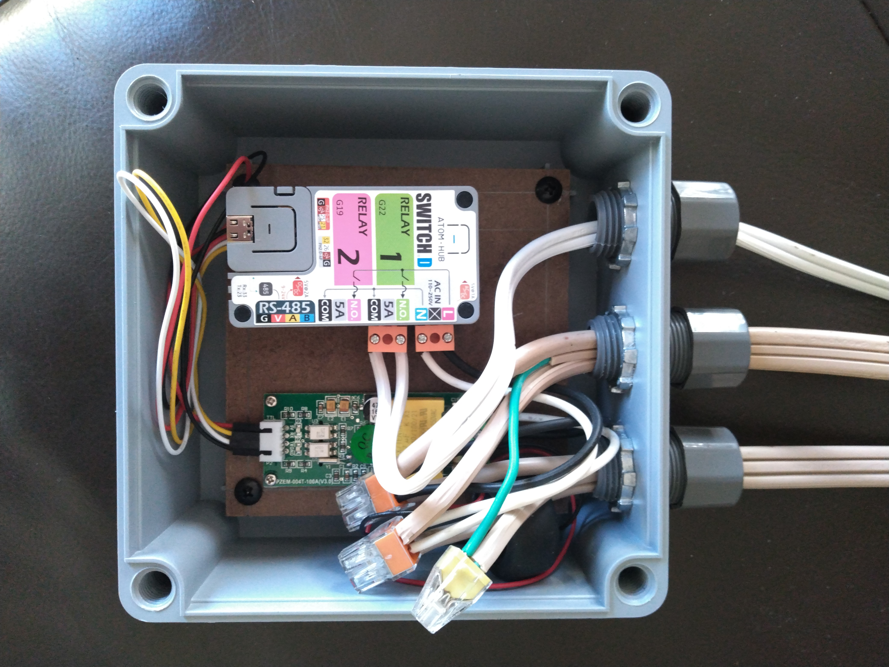

# Garage Fridge

## Overview
This is a [M5Stack ATOM HUB SwitchD](https://shop.m5stack.com/products/atom-hub-switchd-2-relay-kit) mounted in a [box](https://www.amazon.com/gp/product/B07ZBRK5NL) on the side of the garage fridge, paired with a [PZEM-004T](https://www.amazon.com/gp/product/B0855T6VHT) for power monitoring and 2 [Inkbird IBS-TH1 sensors](https://www.amazon.com/gp/product/B0774BGBHS) for temperature in the fridge and freezer sections. Configuration lives in [garage-fridge.yaml](../../devices/garage-fridge.yaml).

## Freeze Protection
One of the relays on the M5Stack ATOM HUB SwitchD controls a pair of [heaters](https://www.amazon.com/gp/product/B07GXSDMR2) inside the fridge to keep it from dropping below freezing (frozen beer is no fun), using ESPHome's [PID climate controller](https://esphome.io/components/climate/pid.html).

## Known Issues / Notes
- The PID tuning isn't quite dialed in — instead of holding a steady equilibrium, the heater output tends to ramp up and down. Even so, actual temperature stays close to the target.
- PID autotune doesn't survive the periodic reboots caused by Bluetooth interference, so autotune hasn't been usable as-is. A custom autotune that can survive restarts is a possible future project.

## Photos

