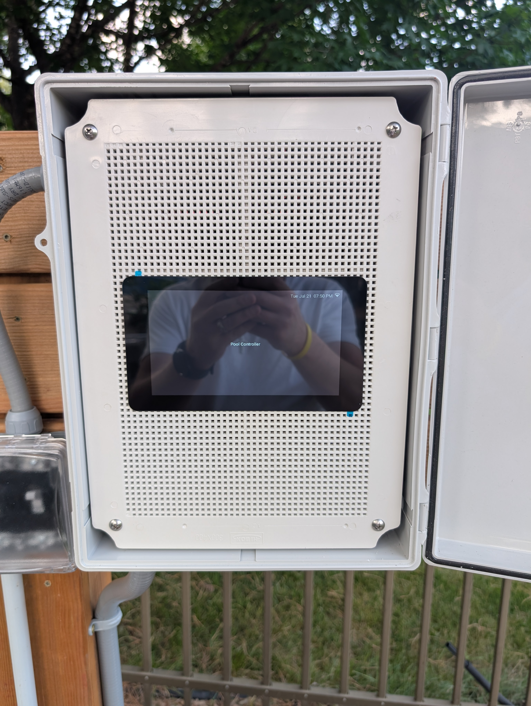
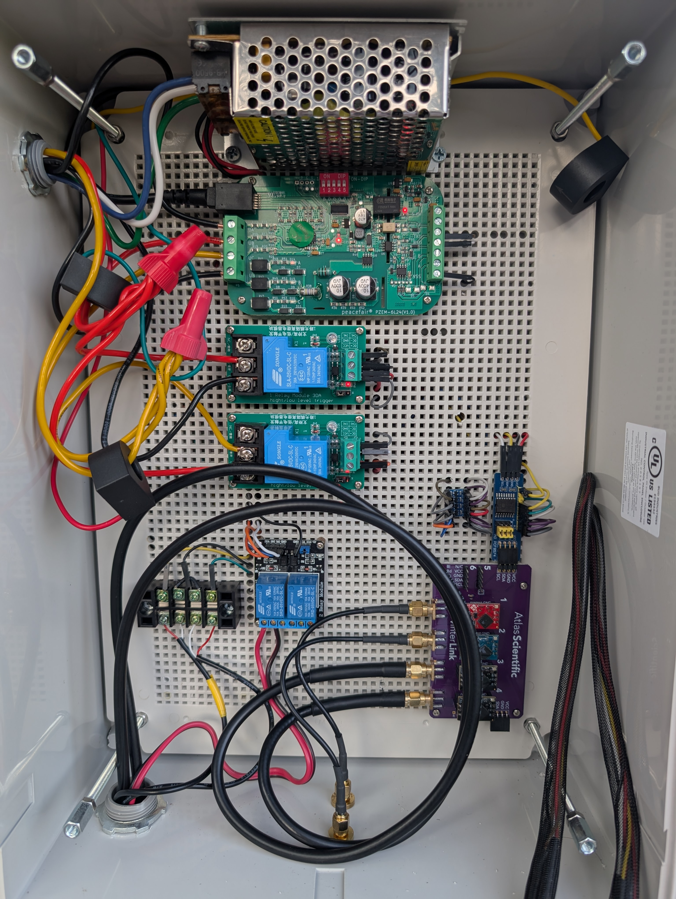

# Pool

## Status
Work in progress — this device is actively being expanded. The sections marked `TODO` below are placeholders waiting on details, photos, and schematics.

## Overview
The pool is controlled by a [Waveshare ESP32-S3 7" Touch LCD B](https://www.waveshare.com/product/esp32-s3-lcd-7b.htm) running a touchscreen UI (LVGL) plus the custom [Pool Controller](../../components/pool_controller/README.md) and [PZEM-6L24](../../components/pzem6l24/README.md) components. Configuration lives in [pool.yaml](../../devices/pool.yaml).

## Hardware
- Controller board: Waveshare ESP32-S3 7" Touch LCD B (`esp32s3`), MIPI RGB display + GT911 touch
- I/O expansion: PCF8574 for pump/heater/cleaner/fill outputs and flow sensor inputs; Waveshare CH32V003 IO for backlight PWM and display reset/power
- Energy monitoring: PZEM-6L24 three-phase meter (pump + cleaner voltage/current/power/energy)
- Water chemistry: Atlas Scientific EZO pH, ORP, water temp, and return temp probes
- TODO: pump/plumbing photos

## Functionality Today
- **Primary pump** — schedule-driven fractional runtime via Pool Controller, with current-sensed flow/anomaly detection
- **Auxiliary (cleaner) pump** — same schedule model, sequenced after the primary pump so it never runs without flow
- **Water chemistry** — pH, ORP, water temp, and return temp reported to Home Assistant
- **On-screen UI** — touchscreen status display that wakes the backlight on touch
- TODO: describe the schedules actually in use day-to-day and how the touchscreen UI gets used

## Planned / In Progress
- Pool heater control (a `pool_heater` block exists but is commented out in `pool.yaml`)
- Fill and drain automation
- TODO: confirm current roadmap

## Photos / Schematics
Full wiring schematic: [Schematic.pdf](./Schematic.pdf)

  

  

TODO — pump/plumbing layout photos.

## History
TODO — brief history of prior iterations (e.g. the earlier Shelly 2.5-based pump-only setup) before the ESP32-S3 controller.
